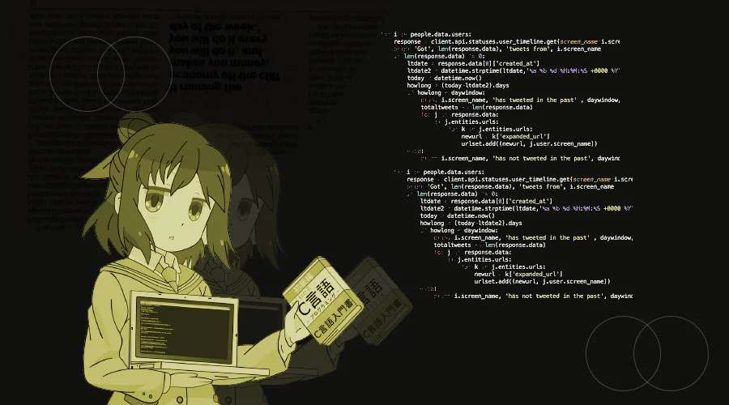

<h1>
  

    <i>
      
      Hi, Aestivial (Nayan Panda) here!
      
    </i>
  

</h1>

  

---

**    Watashi Ni Tsuite:**

- 🔭 I’m currently working on something something...
- 🌱 I’m currently learning more of Python3
- 👯 I’m looking to collaborate on Projects!
- 🤔 I’m looking for help with my Public repos (mostly Python based)
- 💬 Ask me about tech or geeky stuff
- 📫 How to reach me: @aestivial_ on instagram
- 😄 Pronouns: he/him
- ⚡ Fun fact: Steve Jobs was adopted.

---

## Some Stats:

Still a newbie...
  

  
  

  
---
